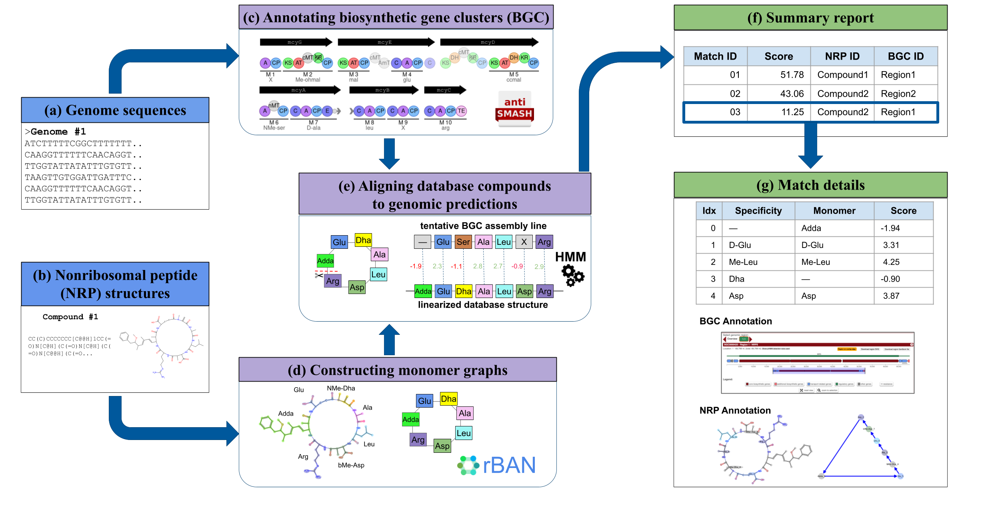

# Nerpa 2.0 Manual

1. [About Nerpa](#sec_about) </br>
   1.1 [Nerpa pipeline](#sec_about_pipeline)</br>
   1.2 [Supported data types](#sec_about_data)</br>
2. [Installation](#sec_install)</br>
    2.1. [Prerequisites](#sec_install_prereq)</br>
    2.2. [Installation from tarball](#sec_install_source)</br>
    2.3. [Verifying your installation](#sec_install_verify)</br>
3. [Running Nerpa](#sec_run)</br>
    3.1. [Quick start](#sec_run_quick)</br>
    3.2. [Command-line options](#sec_run_options)</br>
    3.3. [Output files](#sec_run_results)</br>
4. [Citation](#sec_cite)</br>
5. [Feedback and bug reports](#sec_feedback)</br>

<a name="sec_about"></a>
# About Nerpa

Nerpa is a tool for linking biosynthetic gene clusters (BGCs) to known nonribosomal peptide (NRP) structures.
You can read more about the Nerpa algorithm and the practical applications of the tool in [our papers](#sec_cite).
Nerpa is currently developed and maintained by [Gurevich Lab](https://helmholtz-hips.de/en/hmsb) 
at the [Helmholtz Institute for Pharmaceutical Research Saarland (HIPS)](https://helmholtz-hips.de/en/) 
and the [Center for Bioinformatics Saar (CBI)](https://zbi-www.bioinf.uni-sb.de/en/).

This manual will help you to install and run the tool. Nerpa version 2.0.0 was released on 19.03.2025. 
The tool is dual-licensed and is available under GPLv3 or Creative Commons BY-NC-SA 4.0, see [LICENSE.txt](LICENSE.txt).

<a name="sec_about_pipeline"></a>
## Nerpa pipeline
The simplified Nerpa pipeline is depicted in the figure below.



Nerpa takes as input an NRP structure database and genome sequences.
The pipeline goes as follows:  
1. Construct tentative NRP synthetase assembly lines 
along with respective sequences of genome-predicted residues
(using [antiSMASH](https://academic.oup.com/nar/article/51/W1/W46/7151336)).  
2. Construct representations of the database structures as monomer graphs
(using [rBAN](https://jcheminf.biomedcentral.com/articles/10.1186/s13321-019-0335-x)).  
3. Build HMMs for genome-predicted NRP synthetase assembly lines
as described in [the Nerpa 2 paper](https://doi.org/10.1101/2024.11.19.624380).
4. Extract NRP linearizations from the monomer graphs.  
5. Score the NRP linearizations against the HMMs all-vs-all manner 
(using the [Viterbi algorithm](https://en.wikipedia.org/wiki/Viterbi_algorithm)).  
6. Create an interactive report with the best matches and detailed alignments.  

 
<a name="sec_about_data"></a>
## Supported data types
For **genome sequences**:  

* *Recommended*: complete **antiSMASH output** after processing your raw genome sequence
(e.g., downloaded from the [antiSMASH web server](https://antismash.secondarymetabolites.org/));
or antiSMASH job IDs (in this case, Nerpa will download it automatically).
* *Also accepted*: raw genome sequences in the **FASTA and GenBank** formats; 
in this case, Nerpa will predict NRP BGCs in them with antiSMASH 
(should be installed separately and present in `PATH` or provided to Nerpa via `--antismash-installation-dir`).

For **NRP structures**:

* *Recommended*: [**isomeric SMILES format**](https://en.wikipedia.org/wiki/Simplified_molecular-input_line-entry_system);
Nerpa distinguishes between L- and D-configurations of amino acids, so the use of the isomeric format leads to more accurate results.
* *Also accepted*: any other [**SMILES**](https://en.wikipedia.org/wiki/Simplified_molecular-input_line-entry_system), 
i.e., without stereochemistry information.

*Note:* you can use free online converters to get (isomeric) SMILES from other popular chemical formats such as MDL MOL or InChI,
e.g., [this one from UNM](https://datascience.unm.edu/tomcat/biocomp/convert). Alternatively, there are many command-line convertors, e.g. [molconvert](https://docs.chemaxon.com/display/docs/molconvert.md), or programming libraries, e.g. [RDKit](https://www.rdkit.org/).


<a name="sec_install"></a>
# Installation
<a name="sec_install_prereq"></a>
## Prerequisites

* **(Required)** Nerpa relies on **Java** (to run the embedded rBAN), **Python v3.10 or higher**, and a number of **Python dependencies specified in the [environment.yml](environment.yml)** file.  
  We highly recommend installing [Conda](https://docs.conda.io/projects/conda/en/latest/user-guide/install/index.html) to easily set up all dependencies, as demonstrated below.

* **(Optional)** If you plan to use Nerpa with raw genome sequences (FASTA or GenBank) rather than antiSMASH-processed files, 
you will also need to [install antiSMASH locally](https://docs.antismash.secondarymetabolites.org/install/).  
Alternatively, you can use the [antiSMASH web server](https://antismash.secondarymetabolites.org/).

* **(Optional)** Nerpa is quite fast by default, but we provide an even faster C++ implementation. 
To use it, you will need a **[C++20 compiler](https://isocpp.org/get-started)** and **[CMake v3.10](https://cmake.org/)** or higher.  

<a name="sec_install_source"></a>
## Installation from tarball

First, download and unpack the release tarball:

```commandline
wget https://github.com/gurevichlab/nerpa/releases/download/nerpa_2.0.0/nerpa-2.0.0.tar.gz
tar -xzf nerpa-2.0.0.tar.gz
cd nerpa-2.0.0
```
Next, install all required dependencies. We recommend creating and activating a Conda environment:  

```commandline
conda env create -f environment.yml
conda activate nerpa-env
```
Finally, if you want to use the fast C++ version (optional), compile it by running:

```commandline
bash install.sh
```

<a name="sec_install_verify"></a>
## Verifying your installation

We recommend adding the `nerpa` directory to `PATH`. In this case, you can run Nerpa simply as `nerpa.py` from anywhere;
otherwise, you would need to specify path from the current directory to `./nerpa.py`.
All running examples below assume that Nerpa is in `PATH`.

To test your installation, first, try to get the list of the Nerpa command-line options:  

```commandline
nerpa.py -h
```

Then, try any example from the [Quick start](#sec_run_quick) section and ensure the log contains no error messages.

If you have any problems, please do not hesitate to [contact us](#sec_feedback).

<a name="sec_run"></a>
# Running Nerpa

<a name="sec_run_quick"></a>
## Quick start

Sample test data with three antiSMASH-processed BGCs and three NRP structures in the SMILES format is included in the release tarball.  
Alternatively, you can download it from [here](https://github.com/gurevichlab/nerpa/releases/download/nerpa_2.0.0/test_data.tar.gz) and unpack it in your current working directory.

To run Nerpa on the test data, execute:

```commandline
nerpa.py -a test_data/antismash --smiles-tsv test_data/smiles.tsv -o test_output
```

For details on the output directory content and its interpretation refer to the [corresponding section](#sec_run_results).

<a name="sec_run_options"></a>
## Command-line options

To see the full list of available options, type

	nerpa.py -h
	
All options are divided into four categories. The most important options in each category are listed below.

### General options
- `--process-hybrids`  
process NRP-polyketide hybrid monomers (requires using rBAN).
- `--antismash-path <ANTISMASH_PATH>`
path to antiSMASH installation directory (should contain `run_antismash.py`);
this option is required if genome sequences are provided in the FASTA or GenBank format 
and antiSMASH is not in `PATH`.  
- `--threads <THREADS>`   number of threads for running Nerpa.
- `--output_dir <OUTPUT_DIR>, -o <OUTPUT_DIR>` path to output dir. 
 

### Genomic input (genome sequences or BGCs)

The most convenient way to get antiSMASH predictions of BGC in your genomic data with antiSMASH is to upload your 
FASTA or GBK file to their [webserver](https://antismash.secondarymetabolites.org/). 
When the server job is completed, you may download archive with results ('Download -> Download all results'), unpack it and 
provide the path to the unpacked directory or just the main JSON file from it to Nerpa via option `-a`. 

You can also use [the command-line version](https://docs.antismash.secondarymetabolites.org/install/) of antiSMASH.
Nerpa was tested with outputs from antiSMASH version 7 (7.0.0 and 7.1.0).

Note that you may specify an unlimited number of antiSMASH output files by using `-a` multiple times or by specifying a root directory with many inputs inside.
You may also write paths to all antiSMASH outputs in a single file and provide it via option `--antismash-paths-file`.

Alternatively, you can provide raw genome sequences in the FASTA or GenBank format. 
In this case, you need to have antiSMASH installed on your computer and 
or specify its path via `--antismash-installation-path` option or have it in your system's `PATH` variable.

Finally, you can reuse preprocessed antiSMASH outputs from the Nerpa output for another run with the `--bgc-variants` option.
The preprocessed outputs can be found in the `BGC_variants` directory in the output directory.
This can be useful if you want to use the same antiSMASH output for multiple runs.

### Chemical input (compounds)

NRP molecules should be specified in the [SMILES format](https://en.wikipedia.org/wiki/Simplified_molecular-input_line-entry_system).
One option is to provide them as a space-separated list of SMILES strings via option `--smiles`.
Another way is to write all structures in a multi-column file and specify it via `--smiles-tsv`. 
Default column separator (`\t`), names of the SMILES column (`SMILES`) and the column with molecule IDs 
(*row index*) could be adjusted via option `--sep`, `--col-smiles`, and `--col-id`, respectively.

Nerpa is provided with a set of NRP databases in the SMILES format: 
compounds from 
[MIBiG 4.0](https://mibig.secondarymetabolites.org/) and
[Norine](https://bioinfo.cristal.univ-lille.fr/norine/index.jsp),
available [here](./data/mibig_norine.tsv),
and our own database of putative NRP structures, pNRPdb, available [here](./data/pnrpdb2rc1_summary.tsv).

Alternatively, you can reuse preprocessed compounds from the Nerpa output for another run with
`--nrp_variants` option. 
Using this option can save substantial time when you want to use the same database for multiple runs.
The preprocessed outputs can be found in the `NRP_variants` directory in the Nerpa output directory.

### Processing options

- `--process-hybrids`  process NRP-polyketide hybrid monomers (requires using rBAN);
- `--max-num-matches-per-bgc`  the maximum number of top matches per BGC to report; the default value is 10. 
 If you want to get all matches, set it to 0; 
however, we don't recommend doing that 
because it drastically increases the size of the output.
- `--max-num-matches-per-nrp`  the maximum number of top matches per NRP to report. 
  By default, the value is unlimited.
- `--max-num-matches`  the maximum number of top matches to report; the default value is 100.
If you want to get all matches, set it to 0; 
however, we don't recommend doing that 
because it drastically increases the output size;
- `--threads` the number of threads for running Nerpa; the default value is 1;
- `--skip-molecule-drawing` disable drawing NRP compounds (they will not appear in the graphical report).
Note that Nerpa draws only molecules that appear in top matches, so the number of molecules drawn 
is limited by the `--max-num-matches` option.
Enabling this option significantly speeds up the run and reduces the output size.
- `--force-output-dir`  don't crash if the output directory already exists. 
Note: files in the output directory will be overwritten in this case!


<a name="sec_run_results"></a>
## Output files

The key files and directories inside the Nerpa output directory (`--output-dir`) are:  

* `report.html` interactive HTML report showing the best Nerpa matches, along with the corresponding annotated BGCs and NRPs.
* `report.tsv` matched NRP-BGC pairs with scores.
* `BGC_variants` directory with preprocessed antiSMASH outputs. 
They can be reused for another run via the `--bgc-variants` option.
* `NRP_variants` directory with preprocessed compounds.
They can be reused for another run via the `--nrp-variants` option.

<a name="sec_cite"></a>
## Citation

If you use Nerpa in your research, please cite our papers:  
Nerpa v.2 is described in [Olkhovskii et al, bioRxiv 2024](https://doi.org/10.1101/2024.11.19.624380).  
Nerpa v.1 is published in [Kunyavskaya, Tagirdzhanov et al., Metabolites 2021](https://doi.org/10.3390/metabo11100693).

<a name="sec_feedback"></a>
## Feedback and bug reports
You can leave your comments and bug reports at [https://github.com/gurevichlab/nerpa/issues](https://github.com/gurevichlab/nerpa/issues) (*recommended way*) 
or sent it via e-mail to [alexey.gurevich@helmholtz-hips.de](alexey.gurevich@helmholtz-hips.de).

Your comments, bug reports, and suggestions are **very welcomed**.
They will help us to improve Nerpa further.
In particular, we would love to hear your thought on desired features of the future Nerpa web service.

If you have any troubles running Nerpa, please attach `nerpa.log` from the directory `<output_dir>`.

